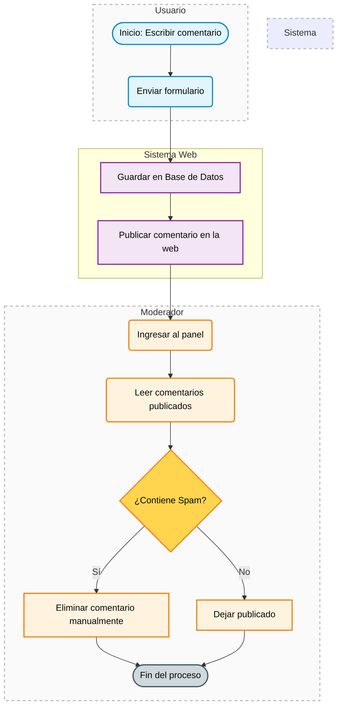
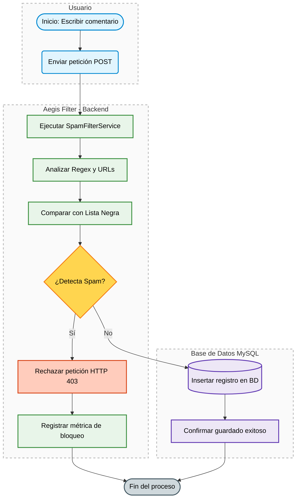
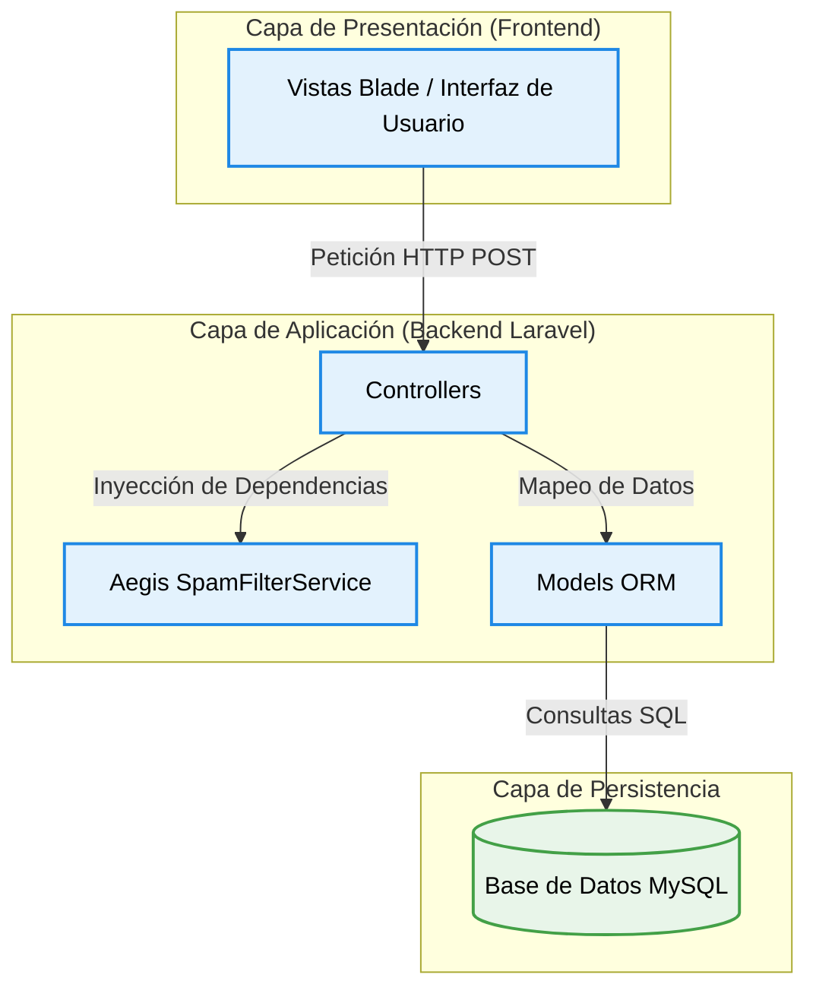
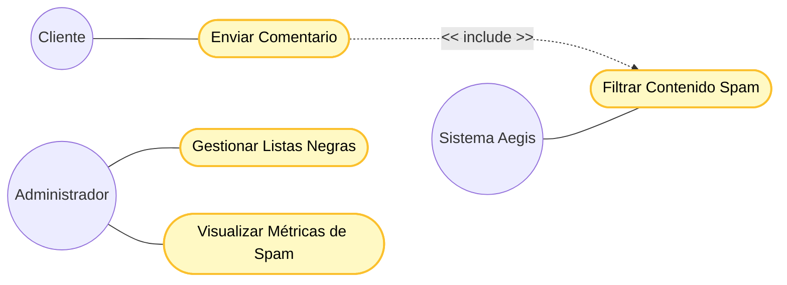
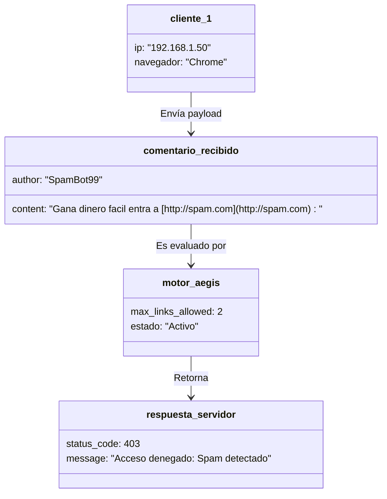
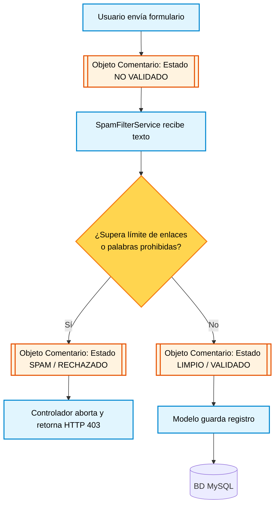
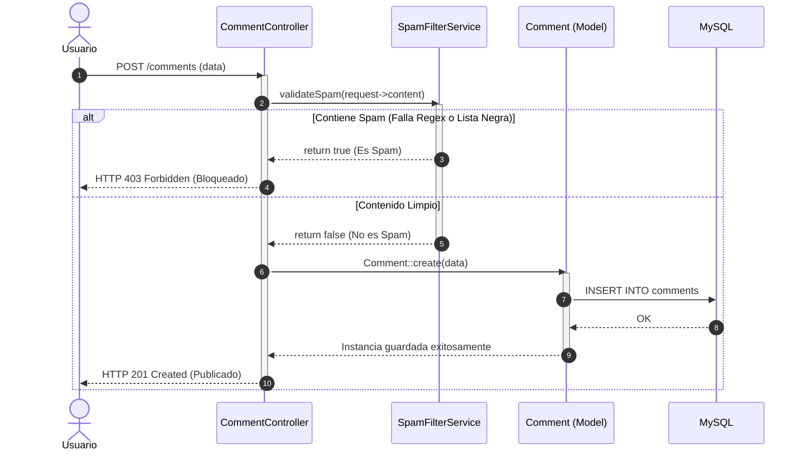
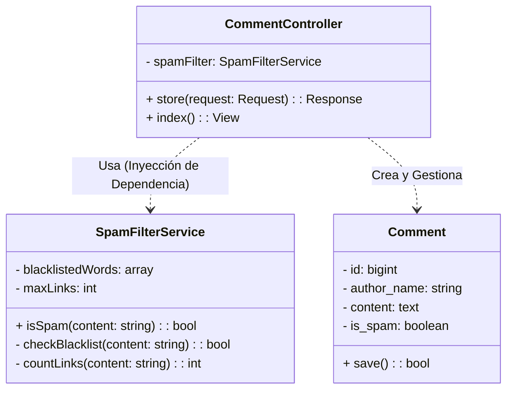

**UNIVERSIDAD PRIVADA DE TACNA**

**FACULTAD DE INGENIERÍA**

**Escuela Profesional de Ingeniería de Sistemas**

**Proyecto Antispam**

Curso: *Base de Datos II*

Docente: *Patrick Cuadros Quiroga*

Integrantes:

- Jahuira Pilco, Dayan Elvis (2022075749)
- Mamani Cori, Cristhian Carlos (2023077282)

**Tacna – Perú**

**2026**

---

Sistema Antispam  
**Documento de Especificación de Requerimientos de Software**  
Versión 1.0  

---

## CONTROL DE VERSIONES

| Versión | Hecha por | Revisada por | Aprobada por | Fecha | Motivo |
|--------|----------|-------------|-------------|-------|--------|
| 1.0 | Cristhian M. | Dayan J. | Patrick C. | 14/04/2026 | Versión Original |

---

# ÍNDICE GENERAL

1. Generalidades de la Empresa
   1.1. Nombre de la Empresa
   1.2. Visión
   1.3. Misión
   1.4. Organigrama
2. Visionamiento de la Empresa
   2.1. Descripción del Problema
   2.2. Objetivos de Negocios
   2.3. Objetivos de Diseño
   2.4. Alcance del proyecto
   2.5. Viabilidad del Sistema
   2.6. Información obtenida del Levantamiento de Información
3. Análisis de Procesos
   3.1. Diagrama del Proceso Actual – Diagrama de actividades
   3.2. Diagrama del Proceso Propuesto – Diagrama de actividades Inicial
4. Especificación de Requerimientos de Software
   4.1. Cuadro de Requerimientos funcionales Inicial
   4.2. Cuadro de Requerimientos No funcionales
   4.3. Cuadro de Requerimientos funcionales Final
   4.4. Reglas de Negocio
5. Fase de Desarrollo
   5.1. Perfiles de Usuario
   5.2. Modelo Conceptual
      a) Diagrama de Paquetes
      b) Diagrama de Casos de Uso
      c) Escenarios de Caso de Uso (narrativa)
   5.3. Modelo Lógico
      a) Análisis de Objetos
      b) Diagrama de Actividades con objetos
      c) Diagrama de Secuencia
      d) Diagrama de Clases
6. CONCLUSIONES
7. RECOMENDACIONES
8. BIBLIOGRAFÍA
9. WEBGRAFÍA

---

# 1. Generalidades de la Empresa

## 1.1. Nombre de la Empresa
Aegis Filter

## 1.2. Visión
Ser una herramienta backend de referencia y código abierto, capaz de integrarse en cualquier plataforma web moderna para proporcionar entornos digitales seguros, limpios y libres de contenido malicioso.

## 1.3. Misión
Proveer un servicio de filtrado automatizado altamente eficiente y fácil de desplegar mediante contenedores, que reduzca la carga de trabajo manual de los moderadores web y proteja a los usuarios finales de enlaces fraudulentos.

## 1.4. Organigrama
* Líder de Proyecto / DevOps (Encargado de Terraform y Azure)
* Desarrollador Backend (Encargado de Laravel y Motor de Reglas)
* Analista QA y Base de Datos (Encargado de Pruebas, Docker y MySQL)

---

# 2. Visionamiento de la Empresa

## 2.1. Descripción del Problema
Las secciones de comentarios y foros en las aplicaciones web son vulnerables a ataques masivos de bots que publican enlaces de phishing, publicidad engañosa y contenido irrelevante (Spam). Las soluciones actuales suelen requerir horas de revisión manual, lo que retrasa la publicación de contenido legítimo y expone la base de datos a información indeseada.

## 2.2. Objetivos de Negocios
* Automatizar la moderación de contenido para reducir el tiempo de revisión manual en un 80%.
* Proporcionar una capa de seguridad preventiva que bloquee los comentarios antes de que sean persistidos en la base de datos de producción.

## 2.3. Objetivos de Diseño
* Construir una arquitectura basada en microservicios (Backend separado) para que sea invisible al usuario final.
* Garantizar un despliegue ágil, inmutable y escalable utilizando Docker y automatización con GitHub Actions.

## 2.4. Alcance del proyecto
El sistema interceptará las peticiones HTTP de creación de comentarios (desarrolladas en Laravel), evaluará el texto utilizando un motor de Expresiones Regulares y Listas Negras (SpamFilterService), y determinará si el registro se inserta en la base de datos MySQL 8 o es rechazado. Todo el entorno estará alojado en la nube de Microsoft Azure.

## 2.5. Viabilidad del Sistema
El sistema es factible técnica y económicamente, respaldado por el uso de herramientas Open Source (PHP, Laravel, Debian) e Infraestructura como Código (Terraform) que optimiza el consumo de recursos en la nube.

## 2.6. Información obtenida del Levantamiento de Información
Se determinó que la principal amenaza de spam consiste en textos repetitivos que contienen más de dos enlaces externos o que utilizan palabras clave fraudulentas recurrentes. Por lo tanto, el sistema debe enfocarse en filtrar estos dos vectores principales.

---

# 3. Análisis de Procesos

## 3.1. Diagrama del Proceso Actual – Diagrama de actividades

## 3.2. Diagrama del Proceso Propuesto – Diagrama de actividades Inicial

---

# 4. Especificación de Requerimientos de Software

## 4.1. Cuadro de Requerimientos funcionales Inicial

| ID | Descripción | Prioridad |
|---|---|---|
| RF-01 | El sistema debe interceptar las peticiones de creación de comentarios en tiempo real. | Muy Alta |
| RF-02 | El sistema debe validar el texto mediante un motor de expresiones regulares para detectar patrones de URL. | Muy Alta |
| RF-03 | El sistema debe comparar el contenido contra una lista negra de términos prohibidos. | Muy Alta |
| RF-04 | El sistema debe registrar métricas sobre la cantidad de comentarios bloqueados y permitidos. | Muy Alta |

## 4.2. Cuadro de Requerimientos No funcionales

| ID | Descripción | Prioridad |
|---|---|---|
| RNF-01 | El sistema debe estar desplegado en Microsoft Azure para garantizar un acceso constante vía web. | Muy Alta |
| RNF-02 | La infraestructura debe ser gestionada mediante Terraform (IaC) para asegurar configuraciones de red cerradas (puerto 3306 bloqueado al exterior). | Alta |
| RNF-03 | La aplicación debe estar contenedorizada en Docker para facilitar actualizaciones inmutables. | Alta |

## 4.3. Cuadro de Requerimientos funcionales Final

| ID | Descripción | Prioridad |
|---|---|---|
| RF-01 | El sistema debe interceptar las peticiones de creación de comentarios en tiempo real. | Muy Alta |
| RF-02 | El sistema debe validar el texto mediante un motor de expresiones regulares para detectar patrones de URL. | Muy Alta |
| RF-03 | El sistema debe comparar el contenido contra una lista negra de términos prohibidos. | Muy Alta |
| RF-04 | El sistema debe registrar métricas sobre la cantidad de comentarios bloqueados y permitidos. | Muy Alta |

## 4.4. Reglas de Negocio

| ID | Descripción | Prioridad |
|---|---|---|
| RN-01 | Un comentario será bloqueado automáticamente si contiene 3 o más enlaces (http o https). | Muy Alta |
| RN-02 | Si se detecta Spam, el sistema debe retornar un código de estado HTTP 403 (Prohibido) o 422 (Entidad no procesable) para evitar que el registro llegue a la base de datos. | Muy Alta |

---

# 5. Fase de Desarrollo

## 5.1. Perfiles de Usuario
* **Administrador / DevOps:** Encargado del despliegue en Azure y la configuración de reglas en el archivo `main.tf`.
* **Moderador:** Responsable de verificar las estadísticas de filtrado en el panel administrativo.

## 5.2. Modelo Conceptual

### a) Diagrama de Paquetes

### b) Diagrama de Casos de Uso

### c) Escenarios de Caso de Uso (narrativa)
* **Como** desarrollador backend...
* **Quiero** crear un servicio de validación por expresiones regulares...
* **Para** identificar comentarios que contengan múltiples enlaces maliciosos de forma automática.

> **Escenario Gherkin: Detección exitosa de Spam por URLs**
> **DADO** que la regla de negocio limita a 2 los enlaces permitidos
> **CUANDO** un usuario envía un comentario con 3 direcciones web diferentes
> **ENTONCES** el sistema debe denegar el acceso a la base de datos
> **Y** registrar el evento como una amenaza bloqueada.

## 5.3. Modelo Lógico

### a) Análisis de Objetos

### b) Diagrama de Actividades con objetos

### c) Diagrama de Secuencia

### d) Diagrama de Clases

---

# 6. CONCLUSIONES
El diseño de Aegis Filter bajo la especificación FD03 asegura un filtrado robusto y preventivo. El uso de criterios de aceptación Gherkin facilitará la creación de pruebas unitarias automáticas en el pipeline de GitHub Actions, garantizando la calidad antes del despliegue.

# 7. RECOMENDACIONES
Se recomienda integrar las métricas de filtrado con un servicio de alertas (como Telegram o Email) para notificar al administrador en caso de ataques masivos de bots en tiempo real.

# 8. BIBLIOGRAFÍA
* Microsoft Azure. (2026). Documentación oficial de máquinas virtuales e infraestructura de Azure.
* HashiCorp. (2026). Terraform Registry: Azure Provider Documentation.
* Laravel. (2026). Laravel 11.x Documentation: Testing and Services.
* Docker Inc. (2026). Docker Compose reference.

# 9. WEBGRAFÍA
* Guías de GitHub Actions y Wikis: https://docs.github.com/es
* Documentación de calidad de código en SonarCloud: https://docs.sonarsource.com/sonarcloud/
* Auditoría de seguridad con Snyk: https://docs.snyk.io/
